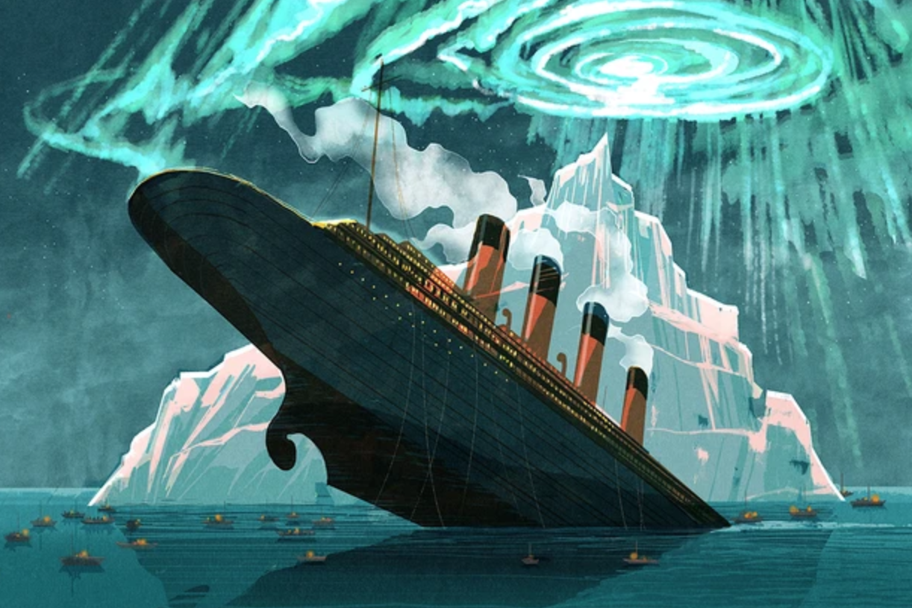

# A Machine Learning Project Predicting the Survival of Passengers on the Titanic
 

 

[Image Credit](https://www.skyatnightmagazine.com/space-science/titanic-sinking-aurora-history/): Jon Powell

# Introduction 

Using the [Titanic - Machine Learning from Disaster](https://www.kaggle.com/c/titanic/data) dataset from [Kaggle](https://www.kaggle.com/), I have built scripts that uses a variety of machine learning algorithms to predict the survival of passengers from the Titanic tragedy.
Here, I will go through the process I used to clean the data and use the Gradient Boosting Classifier to obtain a prediction survival rate of 85%.
While several machine learning classifiers were deployed (Random Forest, Multi-layer Perceptron, and Support Vector Machine) in this small project the Gradient Boosting Classifier appeared to provide the best results.
These result may be revised in the future, but the point of here is to show a non-chemistry example of machine learning work on my resume.

